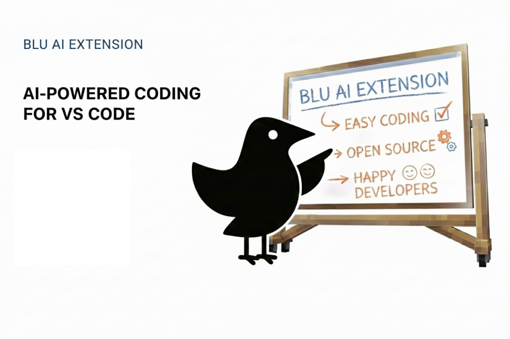

<div align="center">
  <sub>
    <a href="../../README.md">English</a> |
    Español |
    <a href="docs/i18n/README.zh.md">简体中文</a>
  </sub>
</div>

<h1 align="center">
  Blu - Potencia tus herramientas con la que les faltaba.
</h1>

<p align="center">
  


</p>

<div align="center">
  <table>
    <tbody>
      <td align="center">
        <a href="https://marketplace.visualstudio.com/items?itemName=Garv.blu" target="_blank"><strong>Descargar en VS Marketplace</strong></a>
      </td>
      <td align="center">
        <a href="https://github.com/Get-Blu/blu/discussions" target="_blank"><strong>Solicitar Funcionalidades</strong></a>
      </td>
    </tbody>
  </table>
</div>

---

<p align="center">
  
</p>


## ¿Qué es Blu?


**Blu** es una extensión de VS Code impulsada por IA que te ayuda a trabajar desde **objetivos en lugar de prompts**. Describe lo que quieres lograr, y Blu analizará tu base de código, planificará los cambios necesarios y los ejecutará paso a paso—siempre con tu aprobación.

Construido sobre la poderosa base de Cline, Blu extiende el concepto con flujos de trabajo orientados a objetivos mejorados y un enfoque en la colaboración entre desarrolladores.

---

## Características Principales

### Desarrollo Orientado a Objetivos

**Trabaja desde la intención, no desde la implementación.** Simplemente describe tu objetivo—"agregar autenticación de usuario", "refactorizar este componente" o "arreglar el diseño móvil"—y Blu creará un plan detallado antes de hacer cambios.

- **Desglose inteligente de tareas**: Blu analiza tu solicitud y la divide en pasos lógicos
- **Planificación consciente del contexto**: Entiende la estructura de tu proyecto y las dependencias
- **Flujo de aprobación**: Revisa y aprueba cada paso antes de la ejecución

> [!TIP]
> Abre Blu en la barra lateral (Ver → Paleta de comandos → "Blu: Open Sidebar") para trabajar lado a lado con tu código. Esto te da visibilidad completa del proceso de planificación y ejecución de Blu.

<!-- Clear float -->
<div style="clear: both;"></div>

### Comprensión Profunda de la Base de Código
Blu no solo lee archivos—entiende tu proyecto. A través del análisis AST, mapeo de dependencias y búsqueda semántica, Blu se pone al día rápidamente, incluso en bases de código grandes y complejas.

- **Análisis AST**: Entiende la estructura del código y las relaciones
- **Gestión inteligente del contexto**: Solo agrega archivos relevantes al contexto
- **Reconocimiento de patrones**: Identifica patrones comunes y mejores prácticas
- **Conciencia entre archivos**: Entiende cómo los cambios afectan a toda la base de código

<!-- Clear float -->
<div style="clear: both;"></div>

### Ejecución con Humanos en el Bucle

**Siempre estás en control.** Blu presenta un plan claro y muestra diffs antes de hacer cambios. Aprueba, modifica o rechaza cada paso mientras Blu trabaja en tu tarea.

- **Vistas de diff interactivas**: Ve exactamente qué cambiará
- **Aprobación paso a paso**: Controla el ritmo de ejecución
- **Retroalimentación en tiempo real**: Proporciona información mientras Blu trabaja
- **Deshacer/Rehacer**: Control total sobre cada modificación

<!-- Clear float -->
<div style="clear: both;"></div>

### Integración Poderosa de Herramientas

#### Creación y Edición de Archivos
Blu puede crear nuevos archivos, modificar los existentes, e incluso refactorizar en múltiples archivos manteniendo la calidad y consistencia del código.

#### Integración de Terminal
Ejecuta comandos directamente en tu terminal con monitoreo completo de salida. Blu puede:
- Instalar dependencias y ejecutar scripts de construcción
- Iniciar servidores de desarrollo
- Ejecutar pruebas y migraciones
- Desplegar aplicaciones

#### Automatización de Navegador
Para tareas de desarrollo web, Blu puede:
- Lanzar tu aplicación en un navegador
- Interactuar con elementos de UI
- Capturar pantallas y registros de consola
- Depurar problemas visuales y de tiempo de ejecución

### Soporte Multi-Modelo

Usa tu proveedor de IA preferido:

<p align="left">
  
  
  
  

  
</p>

El seguimiento de costos y monitoreo del uso de tokens te ayudan a mantenerte dentro del presupuesto.


<!-- Clear float -->
<div style="clear: both;"></div>

### Extensible vía MCP

Amplía las capacidades de Blu con el **Model Context Protocol**. Crea herramientas personalizadas para tu flujo de trabajo específico:

- **"Agregar una herramienta que obtenga tickets de Jira"** – Trabaja directamente desde requisitos
- **"Agregar una herramienta que verifique el estado de AWS"** – Monitorea infraestructura
- **"Agregar una herramienta que consulte tu base de datos"** – Obtén información de datos reales
- **"Agregar una herramienta que se integre con tu API"** – Conecta con servicios internos

Blu incluso puede ayudarte a crear e instalar estas herramientas automáticamente.

<!-- Clear float -->
<div style="clear: both;"></div>

### Asistencia Consciente del Contexto
Agrega contexto relevante con comandos simples:

- **`@ Agregar Contexto`** – Incluye el contenido de un archivo específico

Escribe para buscar y agrega rápidamente lo que Blu necesita para entender tu tarea.

<!-- Clear float -->
<div style="clear: both;"></div>

### Puntos de Control y Control de Versiones

**Experimenta con seguridad.** Blu crea puntos de control mientras trabaja, permitiéndote:
- **Comparar** cualquier punto de control con el estado actual
- **Restaurar** a puntos anteriores en el tiempo
- **Ramificar** diferentes enfoques
- **Fusionar** experimentos exitosos

Todos los cambios se rastrean en la Línea de tiempo de VS Code para un fácil deshacer.

<!-- Clear float -->
<div style="clear: both;"></div>

---

## Primeros Pasos

### Instalación Rápida
1. **Instala desde VS Code Marketplace**: Busca "Blu" o usa [este enlace directo](https://marketplace.visualstudio.com/items?itemName=Garv.blu)
2. **Abre Blu**: Haz clic en el icono de Blu en la barra de actividades o ejecuta `Blu: Open Sidebar` desde la Paleta de comandos
3. **Configura tu proveedor de IA**: Agrega tu clave API en configuración (Ctrl+, → Extensiones → Blu)
4. **Comienza tu primera tarea**: Escribe un objetivo y deja que Blu planifique la ejecución

---

## Arquitectura y Filosofía

Blu se construye sobre tres principios fundamentales:

1. **Claridad Primero** – Sin cambios ocultos, sin magia. Todo es transparente y explicable.
2. **Control del Desarrollador** – Apruebas cada cambio. Blu sugiere, tú decides.
3. **Inteligencia Colaborativa** – Blu amplifica tus habilidades, no reemplaza tu juicio.

### Cómo Funciona Blu

<p align="center">
  
</p>


1. **Análisis de Objetivos** – Entiende tu intención y requisitos
2. **Recopilación de Contexto** – Analiza las partes relevantes de tu base de código
3. **Generación de Plan** – Crea un plan de ejecución paso a paso
4. **Ejecución Interactiva** – Ejecuta cada paso con tu aprobación
5. **Validación** – Prueba y verifica los resultados

---

## Contribuyendo

¡Bienvenemos contribuciones! Así es como comenzar:

1. **Haz un fork del repositorio** y clónalo localmente
2. **Configura el entorno de desarrollo**:
   ```bash
   npm install
   npm run compile
   ```